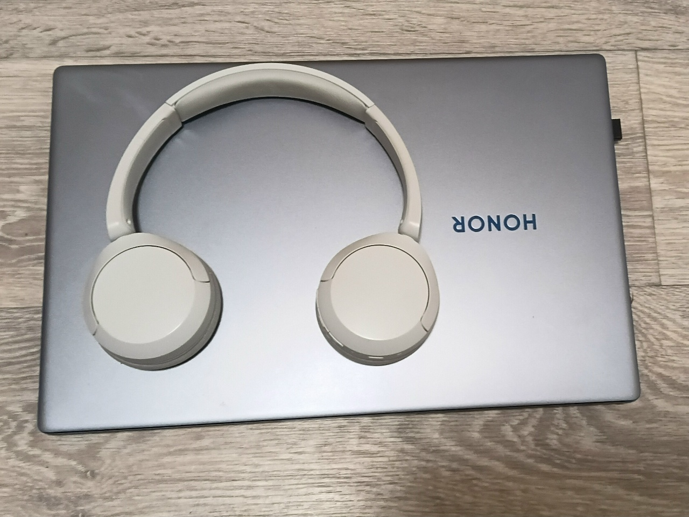

# Лабораторная работа №0

**ФИО:** Габов Даниил Алексеевич

**Группа:** ИВТ-26-1б

Это моя первая лабораторная работа.

## Таблица с дедлайнами

| Источник | Срок | Статус |
|----------|------|--------|
| задание на машине Тьюринга | до 23.09.26 | рука |
| отчёт по блок-схемам | до 22.09.26 | сдан |
| лабораторная 0 | до 23.09.26 | готово |
| презентация от ОРГ | до 23.09.26 | рука |

## Файлы

- `main.cpp` — исходный код программы
- `.gitignore` — исключения для Git (артефакты сборки)

## Сборка и запуск

Открыть **Developer Command Prompt for Visual Studio** и выполнить:

    cl /std:c++17 /EHsc /W4 main.cpp /Fe:hello.exe
    hello.exe

Ожидаемый вывод:

    Hello, C++!

